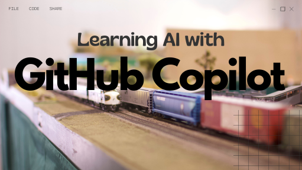

# Learning AI with GitHub Copilot

Welcome! This repository hosts all the demos that were shown in the [*Learning AI with GitHub Copilot*](https://learn.microsoft.com/shows/learning-ai-with-github-copilot/?WT.mc_id=academic-88213-cacaste) video series, with instructions on how to replicate them on your own.
**Click on the image below to watch the series on demand.**

 

*Learning AI with GitHub Copilot* is a series designed for machine learning beginners that would like to get started with Python. It's an exciting learning journey, spanning from supervised learning fundamentals and scikit-learn framework to more advanced topics like computer vision and Pythorch framework. Also, you'll be meeting a special friend along the way, who will help you navigate the AI world.

## Requirements

Before you can run the demos included in this repository, you will need to have the following software installed on your system:

- [VSCode](https://code.visualstudio.com/?WT.mc_id=academic-88213-cacaste)
- [Github](https://www.github.com/?WT.mc_id=academic-88213-cacaste)
- [GitHub Copilot](https://copilot.github.com/?WT.mc_id=academic-88213-cacaste)
- [GitHub Copilot Labs](https://githubnext.com/projects/copilot-labs/?WT.mc_id=academic-88213-cacaste)
- [Github Codespaces](https://github.com/features/codespaces?WT.mc_id=academic-88213-cacaste)

## Instructions to Acquire GitHub Copilot Access

GitHub Copilot is an AI-powered coding assistant that helps you write better code faster. To use GitHub Copilot for free, you can request access to the trial.

To apply for access to the trial go to the [GitHub Copilot website](https://copilot.github.com/?WT.mc_id=academic-88213-cacaste) and follow the instructions. Once you have been granted access to the trial, you can install the [GitHub Copilot extension](https://aka.ms/get-copilot?WT.mc_id=academic-88213-cacaste) and the [GitHub Copilot Labs extension](https://marketplace.visualstudio.com/items?itemName=GitHub.copilot-labs&?WT.mc_id=academic-88213-cacaste) in VSCode.

**GitHub Copilot is free for verified students and teachers.** To apply for the free student and teacher plan, go to the [GitHub Education website](https://education.github.com/?WT.mc_id=academic-88213-cacaste) and follow the instructions.

## Instructions to Acquire GitHub Codespaces Access

GitHub Codespaces is a remote virtual development environment hosted in the cloud that you can customize with your pre-requisites using dev container configuration files. This creates a consistent and reproducible development environment for any user of your project.

Every GitHub user have access to a free Codespaces plan. To learn more about quotas and limits of your plan, check on your own GitHub account [settings](https://github.com/settings/billing). You can use GitHub Codespaces on your browser or within VSCode. To use GitHub Codespaces in VSCode, you will need to install the [GitHub Codespaces extension](https://github.com/features/codespaces?WT.mc_id=academic-88213-cacaste).

To open this repository in GitHub Codespaces on your browser click the button below:

If you are a student or an educator you may request additional benefits on GitHub Codespaces. To learn more about the GitHub Codespaces for students and educators, check the [GitHub Education website](https://education.github.com?WT.mc_id=academic-88213-cacaste).

## How to Download VSCode

VSCode is a free, open-source code editor developed by Microsoft. To download VSCode, follow these steps:

1. Go to the [VSCode website](https://code.visualstudio.com/?WT.mc_id=academic-88213-cacaste).
2. Click on the "Download" button for your operating system (Windows, macOS, or Linux).
3. Once the download is complete, run the installer and follow the instructions to install VSCode on your computer.

Once you have installed VSCode, you can download the the [GitHub Copilot extension](https://aka.ms/get-copilot) extension from the VSCode marketplace and start using them to write code in Python and other programming languages.

## Demos

1. [Machine Learning Fundamentals](./demos/ml-fundamentals.ipynb)
2. [Classification Demo with Scikit-Learn](./demos/classification-demo.ipynb)
3. [Computer Vision Fundamentals](./demos/cv-fundamentals.ipynb)
4. [Computer Vision with PyTorch](./demos/cv-with-pytorch.md)

Demos include the prompts that were used to generate the code with GitHub Copilot. Watch the video series to see the results of the code generation process.
If by replicating the demo you obtain different results, this is expected because GitHub Copilot is based on [OpenAI Codex](https://openai.com/blog/openai-codex?WT.mc_id=academic-88213-cacaste), a Large Language Model whose outputs are not deterministic.

## Authors

- [Carlotta Castelluccio](https://www.linkedin.com/in/carlotta-castelluccio/)
- [Gustavo Cordido](https://www.linkedin.com/in/gcordidoa/)

## Useful Resources

Deep dive into the topics explored in this series:
- [Machine Learning for beginners curriculum](https://github.com/microsoft/ML-For-Beginners?WT.mc_id=academic-88213-cacaste) 
- [Artificial Intelligence for beginners curriculum](https://github.com/microsoft/AI-For-Beginners?WT.mc_id=academic-88213-cacaste)

