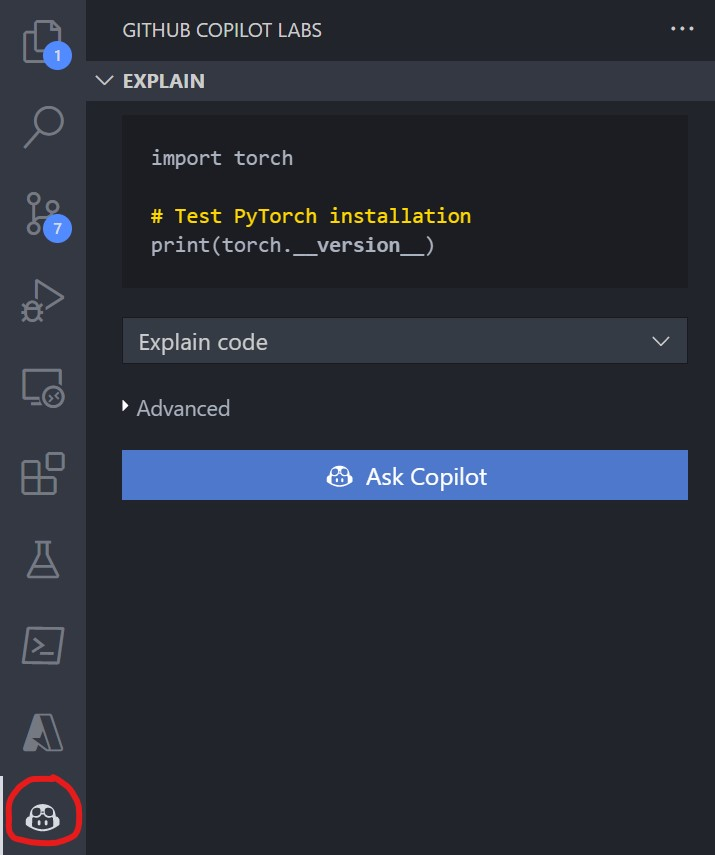

# Computer Vision with PyTorch

Requirements:

- Access to GitHub Copilot.
- GitHub Copilot Labs Extension installed.
- PyTorch.

## Steps to replicate/test

### 1. Installing PyTorch

You can install PyTorch by following these steps:

1. First, check which version of PyTorch is compatible with your system configuration and Python version by visiting the official [PyTorch](https://pytorch.org/get-started/locally/) website.
2. Once you have determined the correct version of PyTorch to install, you can use pip to install it. Open your terminal or command prompt and enter the following command:

```bash
pip install torch torchvision
```

This will install the latest stable version of PyTorch and its related package torchvision.

Alternatively, if you have a specific version of PyTorch that you want to install, you can specify the version number in the pip command. For example, to install PyTorch version 1.9.0, you can use the following command:

```bash
pip install torch==1.9.0 torchvision==0.10.0
```

3. Once the installation is complete, you can verify that PyTorch is installed correctly by opening a Python interpreter and importing the torch module:

```python
import torch

# Test PyTorch installation
print(torch.__version__)
```

If PyTorch is installed correctly, you should see the version number printed to the console.

## 2. Download the *Transfer Learning for Computer Vision* notebook from the PyTorch Website

Head to the [PyTorch Tutorials](https://pytorch.org/tutorials/beginner/transfer_learning_tutorial.html) website, and click on either **Download Notebook** or **View on GitHub** and download from there.

## 3. Exploring the notebook using GitHub Copilot Labs

Finally we can begin exploring the notebook following these steps:

1. Open Visual Studio Code.
2. Ensure that the [GitHub Copilot Labs](https://marketplace.visualstudio.com/items?itemName=GitHub.copilot-labs) extension is installed.
3. Open the previously downloaded notebook.
4. Begin exploring and analyzing the code by highlighting a desired code block and running `Explain` in the GitHub Copilot Labs extension tab.

